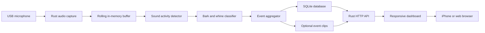

bark-detector

`bark-detector` is a privacy-first, self-hosted system for measuring when and how often a dog barks, whines, or otherwise vocalizes while home alone.

## The problem

As a software engineer and master's candidate at the University of Pennsylvania who recently got a dog, I have been wondering how much noise she makes while I am away. Does she bark or whine after I leave? How frequently does it happen? Is it limited to the first few minutes, triggered by something outside, or does she remain quiet all day?

Without collecting objective data, it is difficult to distinguish an occasional noise from a recurring pattern that could disturb neighbors or indicate stress.

## The solution

`bark-detector` will use a Raspberry Pi Zero 2 W and an omnidirectional USB microphone to monitor sound locally. A Rust service will identify candidate sound events, classify likely dog vocalizations, and store timestamped results in a local SQLite database.

A responsive dashboard will make the data available from an iPhone or another device on the home network. Remote access will eventually be provided through a private VPN rather than exposing the Raspberry Pi directly to the public internet.

The system is designed to process audio locally. It will not save continuous recordings or upload household audio to a cloud service. Short event clips may be retained temporarily for classifier development and verification.

## Planned features

- Continuous, unattended audio monitoring
- Adaptive room-noise estimation
- Bark, whine, howl, other-noise, and uncertain event labels
- Timestamped event history stored in SQLite
- Event duration, confidence, and relative-loudness measurements
- Optional short recordings surrounding detected events
- Daily and hourly vocalization summaries
- Mobile-friendly local dashboard
- Manual relabeling of false detections
- Configurable clip-retention and storage limits
- Device health and microphone-status reporting
- Secure remote access through a private VPN
- Automatic startup and recovery after a reboot

## Proposed architecture



## Hardware

The following components make up the first prototype.

| Qty. | Component | Purpose | Purchase link |
| ---: | --- | --- | --- |
| 1 | Raspberry Pi Zero 2 W | Runs audio detection, event storage, API, and dashboard | [Official product and reseller page](https://www.raspberrypi.com/products/raspberry-pi-zero-2-w/) |
| 1 | Gigastone 64 GB High Endurance microSD card | Stores Raspberry Pi OS, the database, application files, and temporary event clips | [Amazon](https://www.amazon.com/dp/B0GPW2MYH3) |
| 1 | CanaKit 5 V/2.5 A micro-USB power supply | Provides regulated power to the Pi | [Amazon](https://www.amazon.com/dp/B00MARDJZ4) |
| 1 | GeeekPi Raspberry Pi Zero 2 W case kit | Protects the Pi and supplies a heatsink and micro-USB OTG cable | [Amazon](https://www.amazon.com/dp/B08MVH2JJ1) |
| 1 | Acer USB-A/USB-C SD and microSD reader | Writes Raspberry Pi OS to the microSD card | [Amazon](https://www.amazon.com/dp/B0DQ71G4G4) |
| 1 | DUNGZDUZ omnidirectional USB microphone | Captures room audio through a standard USB-A connection | [Amazon](https://www.amazon.com/dp/B0CNVZ27YH) |
| 1 | MOGOOD 3-foot USB-A extension cable | Positions the microphone away from the Pi and its power electronics | [Amazon](https://www.amazon.com/dp/B0C4H494QH) |

The GeeekPi kit includes the required micro-USB OTG cable, so a separate OTG adapter is not required. Its inline power-switch cable will not be used during normal operation; Linux should be shut down cleanly before power is disconnected.

### Hardware connections

```text
CanaKit power supply
    -> Raspberry Pi PWR IN port

USB microphone
    -> USB-A extension cable
    -> GeeekPi USB OTG cable
    -> Raspberry Pi USB port
```

The microphone should be placed away from televisions, HVAC vents, hard corners, and the Raspberry Pi power supply. It should remain unobstructed and outside the dog's reach.

## Planned software stack

The deployed application will be written in Rust. Python may be used offline for model training and evaluation, but it will not be required on the production device.

| Responsibility | Planned technology |
| --- | --- |
| Operating system | 64-bit Raspberry Pi OS Lite |
| Production language | Rust |
| Async runtime | Tokio |
| Audio capture | CPAL with ALSA |
| Signal processing | RustFFT and project-specific DSP |
| Model inference | ONNX through Tract |
| HTTP API | Axum |
| Database | SQLite through SQLx |
| Serialization | Serde |
| Application logging | Tracing |
| Dashboard | TypeScript-based responsive web interface |
| Process supervision | systemd |
| Local discovery | mDNS/Bonjour |
| Remote access | Private VPN |
| Offline model training | Python |

## Event processing

The first version will use a staged detection pipeline:

1. Capture mono audio and normalize it to a 16 kHz internal format.
2. Maintain a short rolling buffer in memory.
3. Estimate the room's background-noise level.
4. Open an event when sustained sound activity exceeds the adaptive threshold.
5. Merge nearby bursts into a single vocalization episode.
6. Extract audio features and classify the event.
7. Write the event metadata to SQLite.
8. Optionally retain a short clip surrounding the event.

The initial classifier may use a combined `dog_vocalization` label before attempting to distinguish barking, whining, and howling. This will allow useful data collection before enough dog-specific training examples exist.

## Privacy and data retention

Privacy is a core design requirement:

- Audio processing happens on the Raspberry Pi.
- Continuous recordings are not stored.
- Audio is not uploaded to a third-party cloud by default.
- Event metadata remains on the local device.
- Temporary event clips have a configurable retention period.
- The system stops creating clips before storage becomes full.
- Remote access uses a private VPN instead of public port forwarding.
- Cloud notifications, if added, contain metadata rather than audio.

The expected default retention policy is to keep event metadata indefinitely while automatically deleting ordinary event clips after 14 days. Manually retained training examples may be exempt from automatic deletion.

## Roadmap

- [ ] Acquire and assemble the prototype hardware
- [ ] Install and configure Raspberry Pi OS Lite
- [ ] Validate reliable USB microphone capture
- [ ] Build the Rust audio-capture service
- [ ] Add adaptive sound-activity detection
- [ ] Add event aggregation and SQLite storage
- [ ] Build the local HTTP API and dashboard
- [ ] Collect and label household audio examples
- [ ] Train and evaluate the first classifier
- [ ] Run ONNX inference from Rust on the Pi
- [ ] Add clip retention and storage safeguards
- [ ] Add health monitoring and automatic recovery
- [ ] Configure secure remote access
- [ ] Evaluate private notification options

## Project status

The project is currently in the planning and hardware-acquisition stage. The architecture and initial bill of materials have been selected, but implementation has not started.

## License

The project is intended to be released under the [Apache License 2.0](https://www.apache.org/licenses/LICENSE-2.0). Code, documentation, trained models, third-party assets, and hardware designs may have different licensing requirements; their applicable licenses will be documented as they are added.
